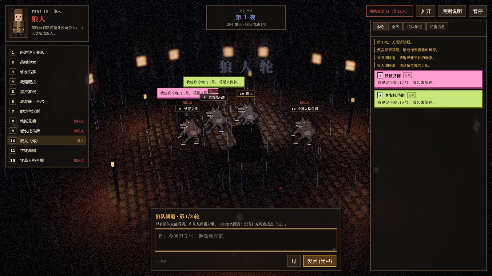
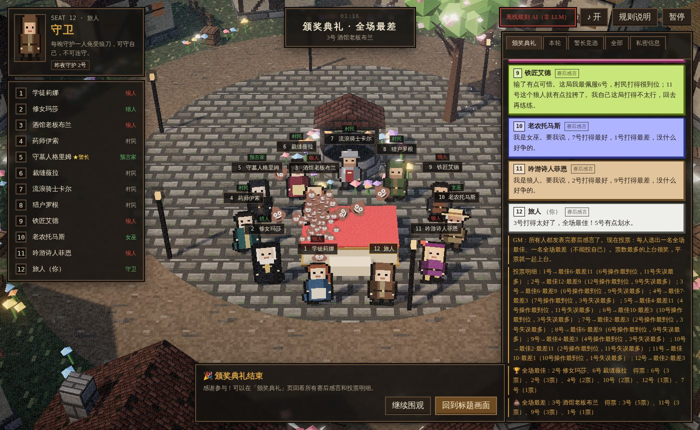
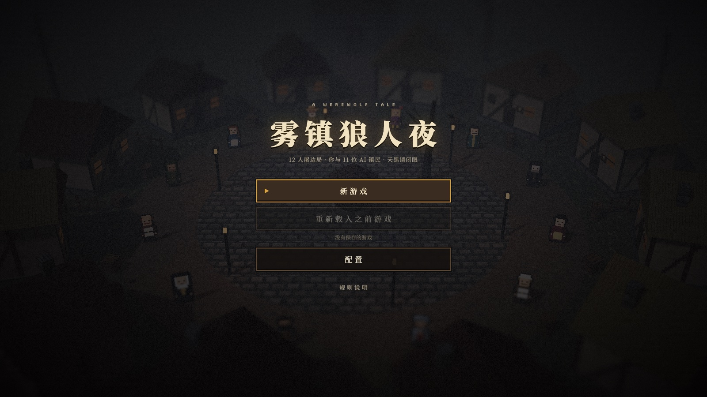

# 雾镇狼人夜 · AI Werewolf



网页版单人狼人杀：你和 11 个由大模型扮演的镇民同桌，打一局 12 人狼人杀（预女猎守：4 狼 / 4 民 / 预言家·女巫·猎人·守卫），按标准流程进行：第一天警长竞选（上警、退水、警徽流），狼人屠边（神职或村民全灭）即狼胜，狼人全部出局即好人胜。
2.5D 像素风（2D 角色 billboard + 3D 场景），中世纪破败小镇，白天乌云、夜晚雷雨，HD-2D 式移轴景深与泛光。

**在线试玩：<https://leoli-dev.github.io/ai-werewolf/>**

## 特点

- **每个 AI 都是独立的玩家**：共享一本公开发言记录，另有各自的私密信息（查验结果、女巫用药、狼队频道），轮流发言、投票、夜间行动。
- **规则手册常驻**：每一次调用模型（发言、狼队沟通、投票、夜间技能）都把完整的《规则手册》放在 system prompt 最前面——全部角色能力、昼夜流程、警长竞选、信息可见性、术语和「用规则推理」的要点，AI 据此判断谁在说谎、下一步怎么打。
- **纯代码裁判**：夜晚顺序、警长竞选、发言 / 投票 / PK / 遗言、胜负判定都由规则引擎执行，模型只负责说话和做决定。
- **警长与警徽**：当选时警徽从天而降飞到新警长头顶，白天一直戴着；警长出局时警徽飞向继承人，或被当场撕碎。
- **任意 OpenAI 兼容模型**：内置 OpenAI、DeepSeek 预设，也可以连本地推理服务（MTPLX、Ollama、LM Studio、vLLM……）。
- **离线规则 AI**：不接模型也能完整走一局，方便体验流程。
- **存档**：随时暂停，下次从标题页继续。
- **结局演出**：狼人胜利时狼人当众兽化、屠尽幸存者，血月下只剩狼嚎与悲歌；好人胜利时迷雾散去、旭日东升，老树开花、路边开满小花，幸存者欢快地转圈，配上轻快的舞曲。
- **颁奖典礼**：结算画面点「🏆 颁奖典礼」，小镇回到阳光白云、鸟语花香，房屋和所有人（包括出局的）恢复原样。GM 以上帝视角把整局完整记录（全部发言、狼队频道、每个人的查验 / 用药 / 守护、投票明细和 AI 自己记下的决策理由）交给每个 AI，并告诉大家现在是赛后测评环节；从 1 号开始每人发表一轮赛后感言、点评谁打得好谁打得差（真人玩家也要说），然后投票选出全场最佳与全场最差（不能投自己，平票一起上台）。广场中央升起领奖台：最佳玩家上台领鲜花，全场鼓掌吹口哨，约 20 秒后下台；最差玩家接着上台，其余玩家围成一圈疯狂往台上扔 💩；真人玩家在台下时会出现「💩 扔！」按钮（或按空格 / 回车），亲手扔多少都行。






## 在线版怎么玩

1. 打开 <https://leoli-dev.github.io/ai-werewolf/>，进入「配置 → AI 引擎」。
2. 选服务商并填入自己的 API Key。Key 用你设的口令加密后只存在本机浏览器里，请求由浏览器直接发往该服务商的官方地址，不会经过任何第三方服务器。
3. 回到标题页，「新游戏」。

想先看看流程，可以把引擎切到「离线规则 AI」，不需要任何 Key。

> 在线版是纯静态网页，没有开发服务器代理。要连**本地模型**，本地服务需要允许跨域（例如 Ollama 设 `OLLAMA_ORIGINS=*`，LM Studio 打开 CORS），或者按下面的方法在本地运行。

## 本地运行

需要 Node.js 20.19+ 或 22.12+。

```bash
npm install
npm run dev        # http://localhost:5173
npm test           # 引擎规则 + prompt 解析测试
npm run typecheck
npm run build      # 静态产物输出到 dist/
```

本地开发时浏览器经 Vite 开发服务器转发请求（`/__llm`），本地推理服务不支持跨域也能用。

### 本地 LLM 配置（`.env`）

「本地 LLM」的**地址和模型列表只来自**项目根目录的 `.env`，游戏、开发服务器代理、`tools/llm_selfplay.ts`、`tools/mtplx_round_bench.py` 都从这里读取。
游戏的配置面板里，地址（含端口）只显示、不能修改；模型是一个下拉列表，只能从 `LLM_MODELS` 里选，不能手动输入。要换服务器或增删模型，请改 `.env`。
`.env` 不进 git；首次 `npm run dev` 时若没有 `.env` 会自动从 `.env.example` 复制一份。OpenAI / DeepSeek 的 Key 在游戏里设置，不放这里。

| 变量 | 说明 |
|---|---|
| `LLM_BASE_URL` | OpenAI 兼容地址（含端口），默认本地 MTPLX `http://127.0.0.1:8001/v1`；游戏只用这一个地址 |
| `LLM_MODELS` | 游戏里可选的模型 id，逗号分隔（`GET /v1/models` 列出的名字），第一个为默认，脚本也用它。例：`LLM_MODELS=qwen3-27b,qwen3-8b`。旧的单个 `LLM_MODEL=…` 仍然可用 |
| `LLM_API_KEY` | 可选；只留在开发服务器，由代理加到请求头，不会打包进浏览器代码 |
| `LLM_REASONING` / `LLM_DECISION_REASONING` | 发言 / 投票·夜间技能·狼队沟通的默认推理强度：none·low·medium·high（游戏里可调） |
| `LLM_USE_PROXY` | 浏览器经 Vite 开发服务器转发（本地服务拒绝跨域时需要；静态构建里无效） |
| `LLM_TIMEOUT_MS` | 单次请求超时 |

改完 `.env` 后 Vite 会自动重启，刷新页面生效。「测试连接」会对照服务端 `GET /v1/models` 的结果，所选模型不在其中时给出提示（不会自动改选）。

## 部署到 GitHub Pages

仓库自带 `.github/workflows/pages.yml`：推送到 `main` 后自动跑测试、构建并发布。
首次使用需在仓库 **Settings → Pages → Build and deployment → Source** 选择 **GitHub Actions**。
构建使用相对路径（`base: './'`），fork 后仓库改名也能直接部署。

网页版只能用 OpenAI / DeepSeek，「本地 LLM」选项是灰的：页面来自公网域名（如 `*.github.io`），浏览器请求 `http://127.0.0.1` 时要过跨域（CORS）和私有网络访问检查，而本地推理服务（如 MTPLX）默认拒绝非同源请求，调用必然失败。
只有页面本身从 `localhost` / `127.0.0.1` 打开时才开放这一项，所以要用本地模型请 clone 仓库后 `npm run dev`。

## 结构

```
src/game/     纯代码 GM 引擎（夜晚顺序、白天发言/投票/平票/遗言、胜负、可见性）
src/ai/       OpenAI 兼容 provider + 串行队列、服务商/模型目录、prompt（规则手册 + 身份策略 + 共享发言记录本 / 警长竞选记录 + 角色私本）、LLM/规则 agent
src/render/   Three.js 场景：程序生成像素贴图、环形小镇、教堂墓地、动物、天气、后期
src/audio/    Web Audio 程序生成的配乐、环境声与音效（无音频文件）
src/ui/       标题页、配置、设置页、HUD（身份牌 + 玩家列表）、发言记录、行动面板、暂停、规则说明
tools/        LLM 自对局脚本、MTPLX 延迟测速脚本
```

## 规则口径

- 夜晚：守卫 → 狼人 → 女巫 → 预言家 → 猎人。守卫可守自己、可空守、不能连守；同守同救仍然死亡。狼人可以刀队友、可以空刀；得票过半即击杀，未过半在被投的选项中随机选一个。
- 女巫有金水时被告知刀口；仅首夜可自救；同一晚只能用一瓶药。预言家查验结果为好人 / 狼人。猎人出局时可开枪（被毒不能开枪），夜里不能主动开枪。
- 第一天先竞选警长、后公布死讯：上警 → 警上发言 → 退水 → 警下投票 → 平票 PK → 再平票警徽流失。警上自爆推迟到次日从退水继续，二次自爆警徽流失。
- 警长 1.5 票，决定发言顺序（单死：死左 / 死右；否则警左 / 警右）并最后归票；出局时移交或撕毁警徽，自爆则警徽流失。
- 遗言：首夜死者与白天死者有遗言，之后夜里死亡和自爆没有。放逐可以弃票；PK 由台下投票，再平票当天无人出局。
- 胜负：狼人屠边（神职全灭或村民全灭）；好人需淘汰全部狼人；同夜同时达成算狼人胜。
- AI 输出无法解析或调用失败时重试一次，然后回退到规则 AI，并在界面提示。
- 存档格式随规则升级为 v2，旧版本的存档不再载入。

## License

[MIT](LICENSE) © 2026 Leo Li
